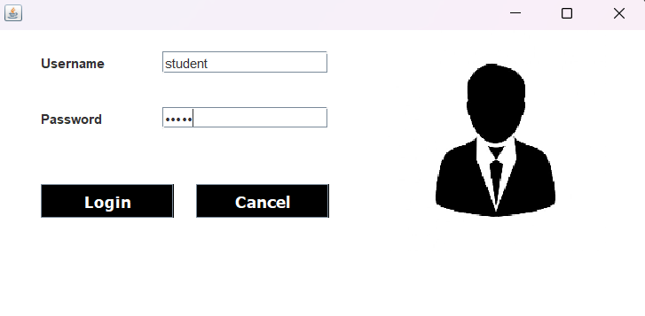
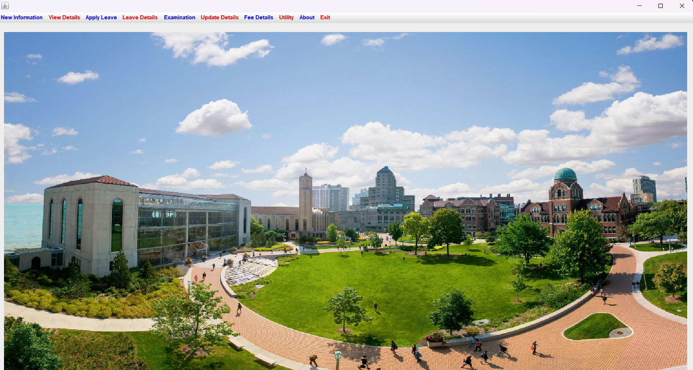
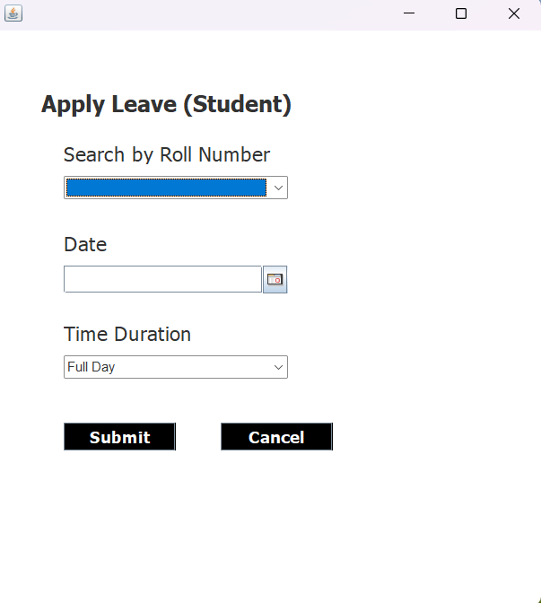

# 🎓 University Management System

A desktop-based **University Management System** developed using **Core Java, Object-Oriented Programming, Java Swing, JDBC, and MySQL**. This application provides an intuitive and efficient way to manage university student records with complete CRUD operations and database integration.

---

## 📸 Project Screenshots

### 🔐 Login Page

<p align="center">
  
</p>

---

### 🏠 Dashboard

<p align="center">
  
</p>

---

### 👨‍🎓 Student Management

<p align="center">
  
</p>

---

## ✨ Features

* 🔐 User Login System
* 👨‍🎓 Student Management
* ➕ Add Student Records
* ✏️ Update Student Information
* 🗑️ Delete Student Records
* 🔍 Search Student Records
* 📋 View Student Details
* 🗄️ MySQL Database Integration
* 🔗 JDBC Database Connectivity
* ♻️ Complete CRUD Operations
* 🖥️ Java Swing Graphical User Interface
* 🧩 Object-Oriented Programming
* 📊 Efficient Student Record Management

---

## 🛠️ Technologies Used

| Technology     | Purpose                      |
| -------------- | ---------------------------- |
| ☕ Java         | Core application development |
| 🧩 OOP         | Application architecture     |
| 🖥️ Java Swing | Graphical User Interface     |
| 🔗 JDBC        | Database connectivity        |
| 🗄️ MySQL      | Data storage and management  |
| 🌐 HTML        | UI-related content           |
| 🎨 CSS         | Styling                      |
| ⚡ JavaScript   | Interactive elements         |

---

## 🗄️ Database

The application uses **MySQL** as its relational database for storing and managing student information.

**JDBC (Java Database Connectivity)** is used to establish communication between the Java application and the MySQL database.

### CRUD Operations

| Operation  | Description                     |
| ---------- | ------------------------------- |
| ➕ Create   | Add new student records         |
| 📖 Read    | Display student information     |
| ✏️ Update  | Modify existing student records |
| 🗑️ Delete | Remove student records          |

---

## 🏗️ OOP Concepts Used

The project applies important **Object-Oriented Programming** concepts to create reusable and maintainable code.

* 🔹 Classes and Objects
* 🔹 Encapsulation
* 🔹 Abstraction
* 🔹 Inheritance
* 🔹 Polymorphism
* 🔹 Constructors
* 🔹 Methods
* 🔹 Method Overloading

---

## 📂 Project Structure

```text
GITA-UniversityManagementSystem/
│
├── login.png
├── dashboard.png
├── student-management.png
│
├── src/
│   └── ...
│
├── lib/
│   ├── mysql-connector.jar
│   ├── jcalendar.jar
│   └── rs2xml.jar
│
├── README.md
└── ...
```

---

## 🚀 How to Run the Project

### 1️⃣ Clone the Repository

```bash
git clone https://github.com/rudraprasadjena123/GITA-UniversityManagementSystem.git
```

### 2️⃣ Open the Project

Open the project using a Java-supported IDE such as:

* Visual Studio Code
* IntelliJ IDEA
* Eclipse
* NetBeans

### 3️⃣ Configure MySQL

Create the required database in MySQL.

Update the database connection details in the Java source code:

```java
String url = "jdbc:mysql://localhost:3306/your_database";
String username = "root";
String password = "your_password";
```

Replace the database name, username, and password with your own MySQL credentials.

### 4️⃣ Add Required Libraries

Make sure the required `.jar` files are available in the project.

Common dependencies include:

* MySQL Connector/J
* JCalendar
* rs2xml

### 5️⃣ Run the Application

Run the main Java class to start the University Management System.

---

## 🎯 Project Objective

The main objective of this project is to develop a practical desktop application for managing university student information while applying real-world concepts of:

* Core Java
* Object-Oriented Programming
* Java Swing
* JDBC
* MySQL
* CRUD Operations
* Database Management

The project demonstrates how a Java desktop application can communicate with a relational database and perform real-world data management operations.

---

## 🔮 Future Improvements

The project can be further enhanced with:

* 👨‍🏫 Faculty Management
* 📚 Course Management
* 📅 Attendance Management
* 💰 Fee Management
* 📊 Student Performance Reports
* 🔐 Role-Based Authentication
* 📈 Analytics Dashboard
* 📄 PDF Report Generation
* ☁️ Cloud Database Integration
* 🌐 Web-Based Version
* 📱 Mobile Application

---

## 📌 Key Highlights

> 💡 A practical Java-based desktop application demonstrating real-world **CRUD operations, database connectivity, GUI development, and OOP concepts**.

* ✅ User-friendly interface
* ✅ Database-driven application
* ✅ Complete CRUD functionality
* ✅ Maintainable Java code
* ✅ MySQL integration
* ✅ JDBC connectivity
* ✅ Swing-based GUI

---

## 👨‍💻 Author

### Rudra Prasad Jena

**B.Tech – Computer Science & Information Technology**

Interested in:

* ☕ Java Development
* 🌐 Full-Stack Web Development
* 🤖 Artificial Intelligence
* 🧠 Machine Learning
* 📚 Data Structures & Algorithms

---

## ⭐ Support

If you find this project useful or interesting, consider giving the repository a ⭐ **Star** on GitHub.

Your support is greatly appreciated!

---

## 📄 License

This project is created for **educational and learning purposes**.

---

<p align="center">
  <b>🎓 University Management System</b>
  <br>
  Built with ☕ Java + 🖥️ Swing + 🔗 JDBC + 🗄️ MySQL
</p>


